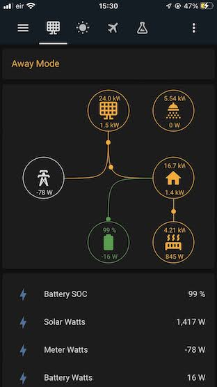
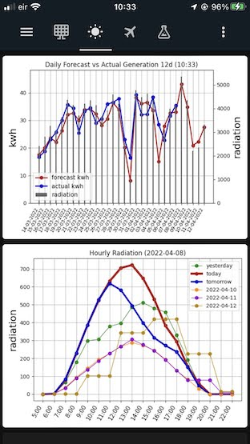
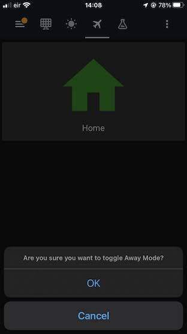

# Home Energy Manager

A program to assist in managing home energy, based around solar electricity generation and battery charging at cheaper rates.


With thanks to [pysolarmanv5](https://github.com/jmccrohan/pysolarmanv5), [solismon3](https://github.com/NosIreland/solismon3) 
and [pymyenergi](https://github.com/CJNE/pymyenergi) 

# Goals
1) Use as much generated electricity as possible for home energy requirements
2) If have to buy electricity, then buy it at the cheapest time/rate
   - Aim to have all electricty consumption be either generated or bought at the cheapest rate
3) Reduce kerosene usage
   - Use free/cheap electricity where previously used kerosene; hot water and home heating
   - Turn off central heating completely/reduce hours during fringe months (spring/autumn), where excess put into Storage Heater can cover morning/evening chills   

# Current scope
1) Forecasts daily generation using data from met.ie, adjusting forecast based on past generation
2) Outputs graphs (.png) of historic and forecasted generation 
3) Automatically charges battery based on forecast:
   - If forecast will not satisfy daily needs
   - If battery is getting critically low and won't last until morning generation
4) Publishes inverter states to mqqt, for consumption in Home Assistant or similar  
5) Publishes EDDI states to mqqt, for consumption in Home Assistant or similar
6) Supports Home vs Away mode
   - Away has lower daily consumption, so less likely to require battery charging
7) Can change EDDI heater priority based on rules (experimental, for MyEnergi API evaluation, and may scrap or move to HA)

# Some future ideas
1) Boost Immersion via EDDI when forecasted generation is below threshold (e.g. when dont forcast much excess, even when battery is charged at night)
   - Install a Cylinder stat and use that as an input too
2) Boost Storage Heater via EDDI when forecasted generation is below threshold / weather forecast is cold/windy
3) Change EDDI heater priority based on Away Mode state
   - i.e. if Away then set Storage Heater as EDDI priority, so that the house is aired for free, instead of the immersion heating unnecesarily
4) Zappi
   - Need to get an EV first!
5) Larger battery 
   - Should support this already by changing a couple of constants defining battery size
6) Use hourly forecast to better determine when morning generation will start, and hence if need a small charge to get to that time
7) Grafana instead of matplotlib

_Note:_ some of these may be better implemented in HA/NodeRed/other


# My Setup
1) Solis Hybrid 6kw 5G inverter
   - The times to stop and start charging are already configured on the inverter
     - This program turns on/off charging and sets current only
2) PureDrive 5kwh battery, discharge limit 20%
3) Always-on NUC, running Ubuntu 20.04
4) MariaDB
5) EDDI, with hub
   - heater1 connected to immersion Bath circuit
   - heater2 connected to a storage heater (can trickle charge, holds heat for a long time/overnight)
6) Bord Gais EV plan
   - The battery charging is geared around using the 2am to 5am period for super-cheap electricity
     - 4.6 cents/kwh now, rising to 6 cents/kwh very soon
7) _ChargeAction_ runs once between 1:45am and 1:59am to match this period
8) Home Assistant

## Using with other setups
1) Other battery sizes
   - Should be able to just change the _BATTERY__ constants in [action_charge.py](./actions/action_charge.py) 
2) Don't have an EDDI
   - Remove the _mye_ actions and services from [main.py](./main.py)
3) Different electricity plan, with different times of cheap rate
   - Modify _ChargeAction.can_execute_now()_ to run before your cheap rate starts
   - If doing the day before, you will need to review thoroughly for uses of _today_ vs _tomorrow_ vs _yesterday_
   - If running between 11AM and 1AM, pay attention to timezones/DST in any date/time calcs
     - Since I'm running after 1AM, this hasn't come into play, and I havent looked into
4) Need differnet integrations
   - Create a new action and add to the list in [main.py](./main.py)
     

# Configuration
Configuration is two-fold:
1) [config.py](./config/config.py) for stuff that rarely needs to change
   - Modify the values in [config.py](./config/config.py) to match your setup 
2) _solar_config_ DB table for stuff that can be tweeked while the app is running, like _log_level_, or how often an action should run


# Database tables
The program requires specific DB tables to be setup, and populated in the case of _solar_config_.
The CREATE TABLE sql is detailed in each case, and the reference data for _solar_config_


## _solar_config_ DB table
```
SHOW CREATE TABLE solar_config;
+--------------+------------------------------------------------------------------------------------------------------------------------------------------------------------------------------------------------------------------------------------------------------------------------------------------------------------------------------------------------------------------------------------------------------------+
| Table        | Create Table                                                                                                                                                                                                                                                                                                                                                                                               |
+--------------+------------------------------------------------------------------------------------------------------------------------------------------------------------------------------------------------------------------------------------------------------------------------------------------------------------------------------------------------------------------------------------------------------------+
| solar_config | CREATE TABLE `solar_config` (
  `prop_key` varchar(255) COLLATE utf8mb4_unicode_ci NOT NULL,
  `prop_value` varchar(255) COLLATE utf8mb4_unicode_ci DEFAULT NULL,
  `prop_type` varchar(255) COLLATE utf8mb4_unicode_ci DEFAULT NULL,
  `prop_comment` varchar(255) COLLATE utf8mb4_unicode_ci DEFAULT NULL,
  PRIMARY KEY (`prop_key`)
) ENGINE=InnoDB DEFAULT CHARSET=utf8mb4 COLLATE=utf8mb4_unicode_ci |
```

## _solar_config_ contents
The contents here should be good for initial setup, you may want to modify based on your own preference.
These are loaded on every cycle, so will take effect without needing to restart.

This is a handy app to update a DB on iphone, so can make config changes while out.
https://apps.apple.com/us/app/tableplus-database-client/id1465448609

```
select * from solar_config;
+---------------------------------+------------------------------------------------------+-----------+---------------------------------------------------------------------------------+
| prop_key                        | prop_value                                           | prop_type | prop_comment                                                                    |
+---------------------------------+------------------------------------------------------+-----------+---------------------------------------------------------------------------------+
| action_freq_secs_mye_mqtt_day   | 9                                                    | int       | NULL                                                                            |
| action_freq_secs_mye_mqtt_night | 3600                                                 | int       | NULL                                                                            |
| action_freq_secs_mye_priority   | 120                                                  | int       | NULL                                                                            |
| action_freq_secs_plot           | 600                                                  | int       | NULL                                                                            |
| away_mode                       | off                                                  | string    | 'on' or 'off'                                                                   |
| away_usage_base_load_wh         | 150                                                  | int       | NULL                                                                            |
| away_usage_daily_wh             | 5000                                                 | int       | NULL                                                                            |
| eddi_priority_switch_rules      | [["time==0", 2], ["battery>94", 1], ["time==11", 1]] | list      | NULL                                                                            |
| forecast_num_days_future        | 3                                                    | int       | NULL                                                                            |
| forecast_num_days_history_max   | 21                                                   | int       | NULL                                                                            |
| forecast_num_days_history_min   | 12                                                   | int       | NULL                                                                            |
| forecast_num_days_use           | 7                                                    | int       | NULL                                                                            |
| forecast_sun_angle_max          | 4.7                                                  | float     | NULL                                                                            |
| home_usage_base_load_wh         | 175                                                  | int       | NULL                                                                            |
| home_usage_daily_wh             | 17000                                                | int       | NULL                                                                            |
| log_level                       | info                                                 | string    | info / warning / error / critical                                               |
| main_sleep_ranges_by_hour       | [[0, 10], [2, 60], [6, 10]]                          | list      | How many seconds to sleep for, by hour                                          |
| plot_num_days_past_override     | -1                                                   | int       | How many days in the past to show in daily graph. -1 means default: window size |
| sunrise_to_real_gen_mins        | 60                                                   | int       | How long after sunrise is there meangingful generation                          |
| update_gen_today                | 1                                                    | int       | 1: update todays generation each time. 0: dont update until tomorrow            |
+---------------------------------+------------------------------------------------------+-----------+---------------------------------------------------------------------------------+

```

## _solar_forecasts_ DB table
This is where the daily forecast is stored, as well as what charging was done.
"Todays" forecast values are locked in when _ChargeAction_ is run; they are never modified after that.

Future forecasts are based on past _radiation_ and _actual_wh_  

```
SHOW CREATE TABLE solar_forecasts;
+-----------------+----------------------------------------------------------------------------------------------------------------------------------------------------------------------------------------------------------------------------------------------------------------------------------------------------------------------------------------------------------------------------------------------------------------------------------------------------------------------+
| Table           | Create Table                                                                                                                                                                                                                                                                                                                                                                                                                                                         |
+-----------------+----------------------------------------------------------------------------------------------------------------------------------------------------------------------------------------------------------------------------------------------------------------------------------------------------------------------------------------------------------------------------------------------------------------------------------------------------------------------+
| solar_forecasts | CREATE TABLE `solar_forecasts` (
  `date` date NOT NULL,
  `radiation` int(11) DEFAULT NULL,
  `forecast_factor` float DEFAULT NULL,
  `forecast_wh` int(11) DEFAULT NULL,
  `battery_initial_wh` int(11) DEFAULT NULL,
  `charge_on` tinyint(1) DEFAULT NULL,
  `charge_wh` int(11) DEFAULT NULL,
  `charge_da` int(11) DEFAULT NULL,
  `actual_wh` int(11) DEFAULT NULL,
  PRIMARY KEY (`date`)
) ENGINE=InnoDB DEFAULT CHARSET=utf8mb4 COLLATE=utf8mb4_unicode_ci |
```

## _solar_radiation_hourly_ DB table
This is where the hourly radiation is stored. For now, this is just used for a graph, but in the future it may be used 
when charging, to know when generation will start in the morning

```
CREATE TABLE `solar_radiation_hourly` (
  `date` date NOT NULL,
  `0:00` int(11) NOT NULL DEFAULT 0,
  `1:00` int(11) NOT NULL DEFAULT 0,
  `2:00` int(11) NOT NULL DEFAULT 0,
  `3:00` int(11) NOT NULL DEFAULT 0,
  `4:00` int(11) NOT NULL DEFAULT 0,
  `5:00` int(11) NOT NULL DEFAULT 0,
  `6:00` int(11) NOT NULL DEFAULT 0,
  `7:00` int(11) NOT NULL DEFAULT 0,
  `8:00` int(11) NOT NULL DEFAULT 0,
  `9:00` int(11) NOT NULL DEFAULT 0,
  `10:00` int(11) NOT NULL DEFAULT 0,
  `11:00` int(11) NOT NULL DEFAULT 0,
  `12:00` int(11) NOT NULL DEFAULT 0,
  `13:00` int(11) NOT NULL DEFAULT 0,
  `14:00` int(11) NOT NULL DEFAULT 0,
  `15:00` int(11) NOT NULL DEFAULT 0,
  `16:00` int(11) NOT NULL DEFAULT 0,
  `17:00` int(11) NOT NULL DEFAULT 0,
  `18:00` int(11) NOT NULL DEFAULT 0,
  `19:00` int(11) NOT NULL DEFAULT 0,
  `20:00` int(11) NOT NULL DEFAULT 0,
  `21:00` int(11) NOT NULL DEFAULT 0,
  `22:00` int(11) NOT NULL DEFAULT 0,
  `23:00` int(11) NOT NULL DEFAULT 0,
  PRIMARY KEY (`date`)
) ENGINE=InnoDB DEFAULT CHARSET=utf8mb4 COLLATE=utf8mb4_unicode_ci
```

# App Overview
[main.py](./main.py) is the primary entry point. It:
- loads the actions to execute
- executes them repeatedly after a configurable sleep interval

It requires one argument: the path the plots (graphs pngs) will be outputted to. E.g.:
```
$ python3 ./main.py /usr/share/hassio/homeassistant/www
```
## Actions
Actions are tasks that can be executed. They can be executed independently, or chained together by adding pre/post actions.

An Action can indicate whether it should be executed now, via _can_execute_now()_. Chained actions do not check this.

Chaining actions is useful for having one Action depend on another, for example updating future forecasts before generating a graph. 
In the future, boosting an EDDI could be a post-action on ChargeAction, for example.

Actions are run in defined sequence, as set in [main.py](./main.py)

## Services
Services wrap the interactions to external facilities. They are  _refreshed_ on each cycle.
Services allow for multiple actions to use the same data/connection, without each action having to get it. 
For example the inverter is polled once per cycle, but several actions use its data.

## Harnesses
These are for test/debug only. 
They give an entry point to running a piece of code, or executing an action, without having to go through [main.py](./main.py)

## Forecasting generation
The ratio between past daily radiation and actual generation is used to predict future generation.
The program chooses the 7 previous days from the past _N_ days, where radiaion was most similar to today, and uses the ratio 
of the sum of their radiations to sum of generations to forecast today. 
_N_ days is the window size, and by default can range between 12, at the time of the year where the sun angle is changing 
a lot (spring/autumn), to 21, when the sun angle is more constant (winter/summer).

In systems where the total panel kwp exceeds the inverter rating, there may be clipping. This will skew the ratios between 
radiation and actual generation. Having the wider window in summer is an attempt to reduce the effect of this. i.e. it'll
use days more like today to make the forecast, rather than being over influenced by very different days. _Note:_ this 
hasnt been tried out on good summer days with clipping yet, so lets see how it works in practice later in the year...


# Executing
I run this outside of Home Assistant for a variety of reasons, including that I find it easier setup/run/debug/monitor,
and also like to have it independent of HA or any other system. Some may prefer to run simalar functions inside HA.

The program may encounter temporary issues from time to time, such as connecting to a DB/Inverter. In some cases it will
attempt a few retries, but eventually, or if there are unexpected issues, it will exit.

[run.sh](./run.sh) wraps [main.py](./main.py) and restarts a few seconds after any issue.
Update _run.sh_ such that its pointing to the full path of [main.py](./main.py), and is passing in an argument specifying
the folder where graphs will be outputted to (make sure the user running as write permission to that location)

_run.sh_ can then be added to crontab, such that it starts at boot:
```
@reboot /home/connesha/Documents/GitHub/home-energy-mgr-main/run.sh >> /var/log/solar/log.log 2>&1
```
Make sure the log location above exists, and the user has write access.

When logging _info_ only, the logs are not large. 
They can be rolled over using _logrotate_
```
/var/log/solar/log.log  {
        daily
        copytruncate
        dateext
}
```

## Running for the first time
Forecasts depend on past generation and radiation data. For the first few days, the graphs will be quite empty, 
and the forecasts may be less accurate. 
For the very first day only, when there is no history at all in the DB, it will use a _forecast_factor_ as defined in 
_Config.FORECAST_FACTOR_INITIAL_.  You could make this first day more accurate by manually caluclating 
(generated watt hours)/(radiation) for a previous day 

**_Note:_** I've been running with several weeks of back-data, so haven't done much testing when the DBs are starting 
from empty. If you encounter issues starting from scratch, let me know. 

# Home Assistant integration

At this stage, most of the real work is outside of HA, and HA is used primarily for showing system status. The exception
is that HA can turn on-off Away Mode.

As it expands, and my comfort level with HA also expands, this may change, and HA may take a more active role


# Power distribution card
mqtt entities may be used for cards such as _tesla-style-solar-power-card_. In this example, the Appliance1/2 are used 
to show the EDDI heater1/heater2 (immersion/storage heater)
```
  - platform: mqtt
    name: "MyEnergi EDDI Heater1 Load"
    state_topic: "myenergi/METRICS"
    unit_of_measurement: "W"
    value_template: "{{value_json.eddi_heater1_load}}"
    device_class: energy
```


**Note:** In this image, there are also several conditional cards at the top to show some information, such as if  
"Away Mode" is enabled. I use these to make warning/error states very prominent any time the app is opened. 
For instance to remind me that Away Mode is on, to inform in case I messed something up and the charge routine 
didnt run last night, or that the battery discharge rate is low (so wont get the full 5kw rate from battery right now).

The source code for this custom card is in [custom-text-card.js](./readme_resources/custom-text-card.js), and the config is:
```
      - type: conditional
        conditions:
          - entity: sensor.ad_config_away_mode
            state: 'on'
        card:
          type: custom:custom-text-card
          display_text: Away Mode
          display_font_size: 3
          display_font_color: orange
      - type: conditional
        conditions:
          - entity: sensor.ad_forecast_today_charge_on
            state: '-1'
        card:
          type: custom:custom-text-card
          display_text: Charge Not Set
          display_font_size: 3
          display_font_color: red
      - type: conditional
        conditions:
          - entity: sensor.battery_discharge_current_limit
            state_not: '100'
        card:
          type: custom:custom-text-card
          display_text: Discharge Current Low
          display_font_size: 3
          display_font_color: orange
 ```

## Graphs
To get the images to update when they are changed, set as camera - local_file:
 ```
camera:
  - platform: local_file
    file_path: /config/www/plot_latest_daily.png
    name: plot_latest_daily
  - platform: local_file
    file_path: /config/www/plot_latest_hourly.png
    name: plot_latest_hourly
 ```



## Toggling Away Mode
_custom:button-card_ is used to (indirectly) execute an appdaemon script that updates the _solar_config_ DB table, toggling 
_away_mode_ .

_Note:_ While HA does have presence detection, the solar AwayMode may need to be set to 'off' the night before you come
home, such that the battery is charged, the water is hot and the house is heated _before_ you arrive. Thats why it's not
currently linked.

 .  . 


# Important
- This is a draft version, a work-in-progress, and things might not work as expected. **Be sure to step through and verify what is happening before just running it.**
- The registers and their values are the ones that work for me. **Be sure to verify that they are suitable for you**, and that the values being set won't mess up your system. Especially these in [service_inverter.py](./services/service_inverter.py)__:
```
HR_CHARGE_LEVEL_ENABLE = 43110
HR_CHARGE_CURRENT_DECI = 43141
HR_CHARGE_TIME_START_HOUR = 43143
HR_CHARGE_TIME_START_MIN = 43144
HR_CHARGE_TIME_END_HOUR = 43145
HR_CHARGE_TIME_END_MIN = 43146
HR_VAL_CHARGE_LEVEL_ENABLE_STOP = 33
HR_VAL_CHARGE_LEVEL_ENABLE_RUN = 35
```
Good luck. I hope it works and you find some parts of it useful, and ping if need more info
